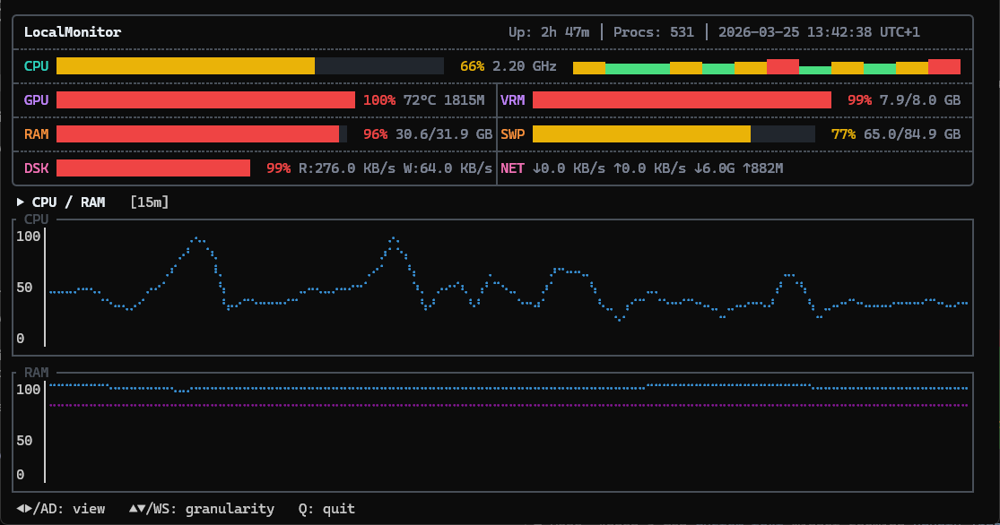

# LocalMonitor

A lightweight, terminal-based system monitor for Windows. Single executable, zero configuration.



## Features

- **Real-time HUD** with color-coded utilization bars and per-core CPU heatmap
- **Historical graphs** with 11 time granularities (1m to 7d)
- **SQLite persistence** — data survives restarts, auto-aggregates over time
- **Single .exe** — no installer, no dependencies, no config files
- **1.9 MB** release binary

## What It Monitors

| Metric | Details |
|--------|---------|
| **CPU** | Overall %, frequency, per-core heatmap (scales to 64+ cores) |
| **GPU** | Utilization %, temperature, fan speed, clock (NVIDIA via NVML) |
| **VRAM** | Used / total |
| **RAM** | Used / total |
| **Swap** | Pagefile used / total |
| **Disk** | Capacity %, read/write IO rates |
| **Network** | Download/upload rates, cumulative totals |
| **System** | Uptime, process count, local datetime with timezone |

## Usage

```
localmonitor.exe
```

That's it. The database is created automatically at `%LOCALAPPDATA%\LocalMonitor\localmonitor.db`.

## Controls

| Key | Action |
|-----|--------|
| `←` / `A` | Previous graph view |
| `→` / `D` | Next graph view |
| `↑` / `W` | Shorter time granularity |
| `↓` / `S` | Longer time granularity |
| `Q` / `Ctrl+C` | Quit |

## Graph Views

Cycle through 4 views with arrow keys:

1. **CPU & RAM** — CPU utilization / RAM + swap
2. **GPU & VRAM** — GPU utilization + temperature / VRAM
3. **Disk IO** — Read rate / Write rate
4. **Network** — Download / Upload speeds

## Time Granularities

1m, 5m, 15m, 30m, 1h, 2h, 4h, 8h, 24h, 3d, 7d

Data is automatically downsampled and retained: 1-second resolution for the last minute, progressively coarser averages for longer windows, up to 7 days.

## Building from Source

Requires [Rust toolchain](https://rustup.rs/) and NVIDIA drivers (for GPU metrics; app works without GPU).

```bash
cargo build --release
```

Binary: `target/release/localmonitor.exe` (~1.9 MB)

## Requirements

- Windows 10/11
- NVIDIA GPU with drivers (optional — GPU/VRAM panels show N/A without it)

## Tech Stack

Rust, [Ratatui](https://ratatui.rs/), [Crossterm](https://github.com/crossterm-rs/crossterm), [SQLite](https://www.sqlite.org/) (via rusqlite), [sysinfo](https://github.com/GuillaumeGomez/sysinfo), [nvml-wrapper](https://github.com/Cldfire/nvml-wrapper)

## Author

[Omar Atieh](https://github.com/OmarAtieh)
